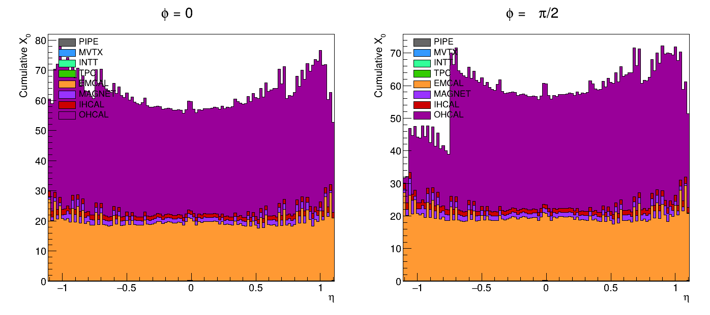
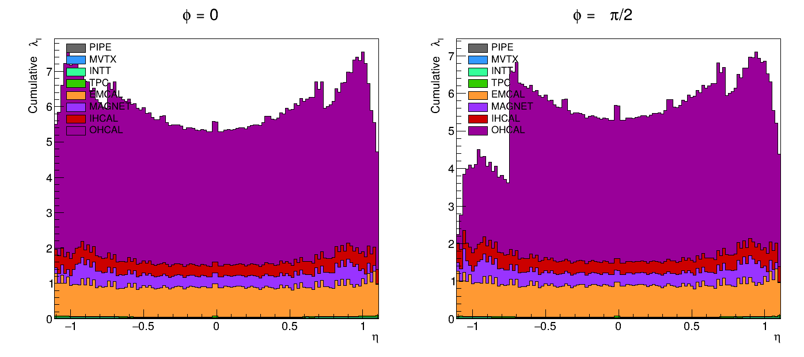

# Baseline material scan

Radiation length (X₀) and nuclear interaction length (λ_I) traversed by a particle
from the vertex, as a function of pseudorapidity η, for the full sPHENIX detector —
broken down per subsystem in the order material is actually added going outward in
radius: beampipe, MVTX, INTT, TPC, EMCal, solenoid magnet, IHCal, OHCal.

This is the idealized case: a single ray per (η, φ) fired from a fixed vertex at
z=0. See [`../smearing_scan/`](../smearing_scan/) for the Monte Carlo companion
that instead smears the vertex position and φ over one HCal sector.




## Method

sPHENIX's own [tutorials repo](https://github.com/sPHENIX-Collaboration/tutorials/tree/master/materialscan)
has a material-scan tool built on Geant4's built-in `G4MaterialScanner` UI
commands — not found in the `macros` or `coresoftware` repos, which is what an
initial check missed. This tool instead hand-rolls the ray trace directly
against a `G4Navigator`, which makes it straightforward to extend with the
vertex/φ smearing in `../smearing_scan/`. `MaterialScan.C`:

1. Builds the actual Geant4 geometry for the 8 subsystems above via `PHG4Reco` —
   the same code real simulation jobs use — using `Fun4AllServer::BeginRun()` to
   construct geometry without needing an event generator or event loop.
2. Walks a `G4Navigator` in a straight line from the vertex outward for a grid of
   η ∈ [-1.1, 1.1] (step 0.02) at two fixed φ values (0 and π/2 — the second to
   catch material in the "chimney"/service-penetration sector), accumulating
   `stepLength / material->GetRadlen()` and `stepLength / material->GetNuclearInterLength()`
   at every geometry boundary crossing.
3. Classifies each step into a subsystem by walking its full volume ancestry
   against a name/keyword table ([`../common/SubsystemClassifier.h`](../common/SubsystemClassifier.h),
   shared with the smearing scan) built from reading the actual detector
   construction source (not guessed), with an explicit `OTHER` bucket for
   anything unmatched — the scan prints a diagnostic summing any unclassified
   volume so nothing is silently dropped.

This captures real effects an analytic model would miss: support ribs, flanges,
the true magnet-between-EMCal-and-IHCal radial position, and the EMCal/HCal
tower structure.

`PlotMaterialScan.C` reads the resulting CSV and produces the two stacked plots
above (φ=0 and φ=π/2 side by side), stacked in the true physical radial order
found by the scan.

`PlotSubsystemBudget.C` reads the same CSV and produces unstacked, overlaid
line plots of just EMCAL, MAGNET, IHCAL, and OHCAL — useful when you need to
read off one subsystem's own X₀/λ_I value directly, which the stacked plots
above make hard to do since each system sits on top of the others.

### Genuine geometric gotchas (and how they're handled)

**The η=0 seam.** Firing a ray at exactly η=0 gives a direction with zero
z-component. sPHENIX's EMCal is built as two z-symmetric, projective/tilted
tower halves meeting exactly at z=0 — a ray at precisely η=0 runs along the row
boundary between them and can graze past all towers for the full radial depth
(confirmed with a per-step debug dump: the ray sat in the EMCal sector's
vacuum-filled *mother* volume for the entire ~20 cm depth without ever
entering a tower solid, vs. ~19-22 X₀ at every neighboring η). This is a
measure-zero navigation degeneracy, not real detector material, so each grid
η is offset by half a bin step before computing the ray direction; the
unshifted η is still what gets written out and plotted.

**A second, only partly-cured seam at η≈0 in OHCal.** Even with the half-bin
offset above, the rays nearest η=0 (nominal η=0 and η=-0.02, whose shifted ray
directions land at η=+0.01 and -0.01 respectively) still pick up one extra
~1.8 cm slice of OHCal outer steel (`av_13_impr_23_OuterHCalSector_Steel_pv_0`)
that a "clean" reference ray (η=0.1) never touches — confirmed with a per-step
debug dump comparing the three rays directly. This shows up as a real,
reproducible ~4% upward spike in the published `X0_vs_eta`/`subsystem_X0_vs_eta`
plots at exactly those two η values. Flagged externally by Chris Pinkenburg,
who noted sPHENIX has a real gap in the OHCal *scintillator* at η=0 but not in
the steel — matching this scan's own scintillator numbers (very slightly
*lower* near η=0, as expected) but contradicted by the *steel* spike, which
points at the same class of near-θ=90° grazing/edge-of-volume effect as the
EMCal seam above rather than a real detector feature. Not yet worked around;
the half-bin offset (0.01 rad) isn't enough to clear it for this particular
boundary. A similar ~3.5% jump exists in OHCal at |η|≈0.34–0.40, symmetric in
η sign, riding on top of the smaller sawtooth ripple from ordinary
tower-plate boundary crossings visible throughout the whole OHCal curve.
Same class of effect, different boundary: comparing full step-by-step debug
dumps for neighboring rays shows the *outermost* OHCal steel plate's path
length swinging sharply between adjacent η bins 0.02 apart — e.g. η=0.36
crosses it in two sub-steps totaling 1.76 X₀-equivalent path length, while
η=0.38 crosses the same plate in a single ~2 cm shorter sub-step (0.68
X₀-equivalent). The ray's exit point through that outer boundary is
apparently hypersensitive to the exact crossing angle, the same underlying
grazing sensitivity as the η=0 seam, just striking the plate's outer radial
edge instead of an internal seam.

## Requirements

- An sPHENIX offline software environment (this was built/run against release
  `ana.568` on the SDCC cluster).
- A checkout of the [sPHENIX macros repo](https://github.com/sPHENIX-Collaboration/macros),
  used only for its per-detector `G4Setup_sPHENIX.C` geometry-construction helpers,
  cloned at the repo root (shared with `../smearing_scan/`):

  ```
  git clone --depth 1 https://github.com/sPHENIX-Collaboration/macros.git
  ```

## Running

```bash
cd baseline_scan
export ROOT_INCLUDE_PATH="$PWD/../macros/common:$PWD/../macros/detectors/sPHENIX:$ROOT_INCLUDE_PATH"
root -b -q 'MaterialScan.C("material_scan.csv")'
root -b -q 'PlotMaterialScan.C("material_scan.csv")'
root -b -q 'PlotSubsystemBudget.C("material_scan.csv")'
```

`MaterialScan.C` takes an optional second argument (`debugEta0`) that dumps every
step's volume/material name in the EMCal radius window for the η=0, φ=0 ray —
useful if you extend the η/φ grid and need to debug a similar boundary artifact.

## Output

- `material_scan.csv` — columns `phi, eta, subsystem, sumX0, sumLambdaI`, one row
  per (φ, η, subsystem) with nonzero material.
- `X0_vs_eta.{pdf,png}`, `lambdaI_vs_eta.{pdf,png}` — the two stacked plots.
- `subsystem_X0_vs_eta.{pdf,png}`, `subsystem_lambdaI_vs_eta.{pdf,png}` — unstacked
  EMCAL/MAGNET/IHCAL/OHCAL overlay plots.

## Caveats

- Only the 8 named subsystems are built; MBD, EPD, ZDC/beamline, micromegas/TPOT,
  and the plug door are deliberately excluded, so this is the material budget of
  those 8 systems, not the full as-installed detector.
- Uses the sPHENIX-standard `CDB_GLOBALTAG = "MDC2"` (the default in every other
  Geant4-geometry-building macro in the `macros` repo) with `TIMESTAMP = 6`, which
  pulled a `Run2024` MVTX/INTT survey/alignment payload from CDB at scan time —
  this is the community-standard default for building simulation geometry, not a
  specific production tag pinned for a particular analysis.
- The world material is set to `G4_Galactic` (vacuum) rather than air, per the
  sPHENIX code's own comment marking that as the intended setting "for material
  scans" — air's contribution to X₀/λ_I is negligible regardless.
- It's unconfirmed whether the solenoid geometry built here uses the detailed
  BaBar-magnet-coil model or a simplified aluminum-cylinder placeholder (per
  Chris Pinkenburg) — this affects how literally the MAGNET curve should be
  read.
- `PlotSubsystemBudget.C` only overlays EMCAL, MAGNET, IHCAL, and OHCAL — those
  four sit closest together in the stacked plots and are the hardest to read
  off individually; PIPE, MVTX, INTT, and TPC are omitted from that overlay
  since they're already readable at the bottom of the stack.
