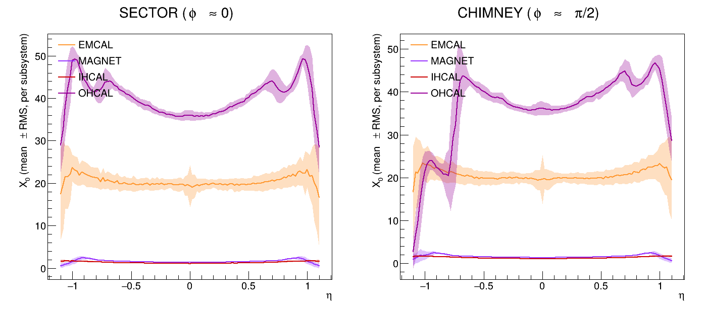
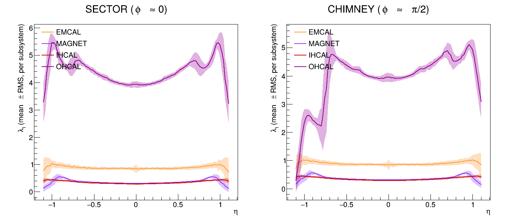

# Vertex/φ-sector smearing scan

Monte Carlo companion to [`../baseline_scan/`](../baseline_scan/). Instead of
one idealized ray per (η, φ) from a fixed vertex at z=0, this fires many rays
per η point with:

- **z_vertex ~ Gaussian(0, 10 cm)** — the real sPHENIX luminous region, rather
  than an idealized vertex at z=0.
- **φ ~ Uniform over one HCal sector width (2π/64)**, centered on each of two
  representative regions: a normal sector (**SECTOR**, φ≈0) and the
  chimney/service-penetration sector (**CHIMNEY**, φ≈π/2) — matching the two φ
  values the baseline scan used as single points.

Pseudorapidity η is defined relative to each ray's own (smeared) vertex,
exactly as a real track's η would be, so this reflects the material budget
seen by tracks from the real luminous region and across one repeating φ
sector, not just the single idealized ray the baseline scan traces.




Each subsystem is shown as a mean line with a shaded ±1 RMS band from the
smearing, for EMCAL/MAGNET/IHCAL/OHCAL only — same 4-subsystem choice as
`../baseline_scan/PlotSubsystemBudget.C`, for the same reason (those four are
the ones worth reading off individually).

## A real Geant4 navigation bug, and how it's handled

Unlike the baseline scan (which always starts at z≈0), this scan's randomized
starting z can land the very first navigator locate call inside a Geant4
parameterised-volume region whose voxel acceleration structure was never
built for that region, dereferencing a null voxel-header pointer
(`G4ParameterisedNavigation::ParamVoxelLocate`, `pHead=0x0` — confirmed via a
gdb backtrace on the actual crash). This is a real bug/limitation in Geant4's
navigation of the sPHENIX geometry, not something fixable from this macro,
and it's a raw SIGSEGV so it can't be caught with try/catch.

It's also not rare or confined to extreme η: in the SECTOR region (φ≈0) it
hits **~34% of all rays**, across the entire η range, for z-offsets as small
as under 1 cm. The CHIMNEY region (φ≈π/2) is entirely unaffected — 0 crashes
in a full 200-sample-per-η production run. This points at some parameterised
volume specifically near φ=0 (plausibly MVTX/INTT's per-ladder placement,
though not confirmed) whose voxel structure only gets exercised off the
nominal z=0 axis.

An earlier attempt sandboxed each ray in its own forked child process
(cheap — the built geometry is inherited via copy-on-write) reporting results
back over a pipe. That fought ROOT/`TSystem`'s own `SIGCHLD` handling (a known
ROOT gotcha) and gave unreliable results — reads would come back short even
though the child had exited cleanly. The approach that actually works: each
ray installs a `SIGSEGV` handler and wraps its own navigation in
`sigsetjmp`/`siglongjmp`. Since the fault is a null-pointer *read* (confirmed
by the backtrace and `dmesg`'s `error 4`), no memory gets corrupted before the
jump, so recovering is safe as long as the `G4Navigator` that was mid-call is
discarded afterward — which happens naturally since a fresh navigator is
created for every ray anyway. Dropped rays are logged (region, η, sample,
z_vtx, φ) and simply excluded from that η bin's mean/RMS, with the actual
surviving sample count written to the `nsamples` column — no η bin was lost
entirely in the production run.

## Requirements

Same as [`../baseline_scan/`](../baseline_scan/) — an sPHENIX offline
environment plus a `macros` checkout at the repo root.

## Running

```bash
cd smearing_scan
export ROOT_INCLUDE_PATH="$PWD/../macros/common:$PWD/../macros/detectors/sPHENIX:$ROOT_INCLUDE_PATH"
root -b -q 'VertexPhiSmearScan.C("vertex_phi_smear.csv", 200)'
root -b -q 'PlotVertexPhiSmear.C("vertex_phi_smear.csv")'
```

`VertexPhiSmearScan.C` takes optional arguments
`(outfile, nSamples=200, zSigmaCm=10.0, seed=12345)`.

## Output

- `vertex_phi_smear.csv` — columns
  `region, eta, subsystem, nsamples, meanX0, rmsX0, meanLambdaI, rmsLambdaI`,
  one row per (region, η, subsystem) with nonzero material. `nsamples` is the
  number of rays that survived to contribute to that row (see above).
- `smear_X0_vs_eta.{pdf,png}`, `smear_lambdaI_vs_eta.{pdf,png}` — the
  mean±RMS overlay plots above.

## Caveats

- Same 8-subsystem scope, CDB tag, and world-material caveats as
  [`../baseline_scan/`](../baseline_scan/).
- The ~34% ray-drop rate in the SECTOR region is real and explained above, not
  silently absorbed — but it does mean the SECTOR curves are built from
  meaningfully fewer effective samples than CHIMNEY's full 200/point.
- The sector width (2π/64) matches the HCal's ~64-fold scintillator-tile
  segmentation; the steel absorber sectorization is coarser (32-fold), so this
  width isn't necessarily the right period for every subsystem's own
  structure.
